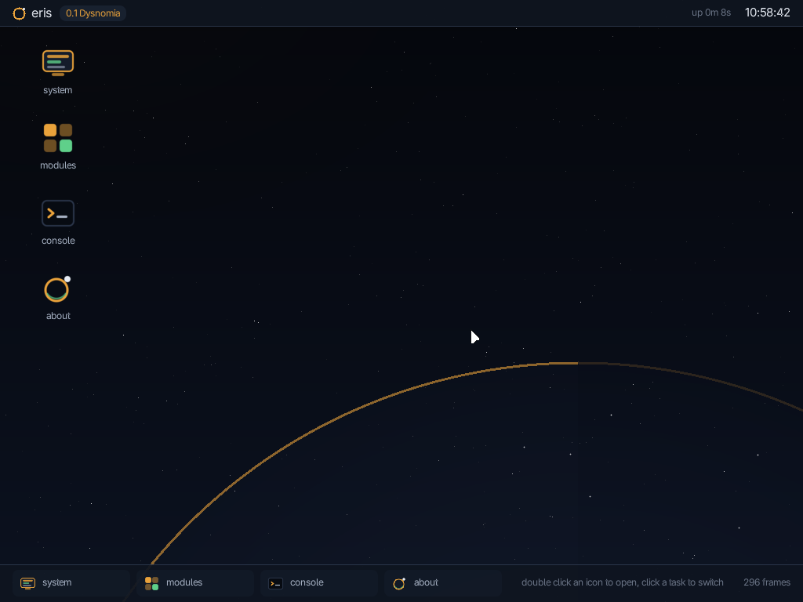
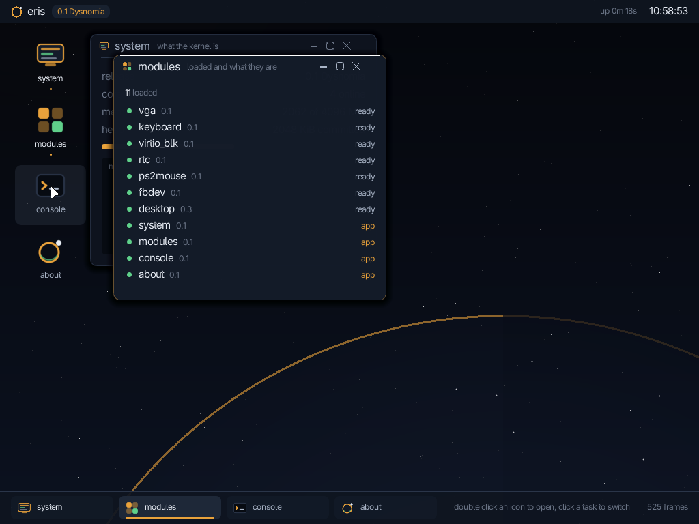

# eris

Barebone x86_64 kernel written in C++23. Nothing much



The shell is a module, the applications on it are modules of their own, and the
text is TrueType rasterised at run time. `make run` brings it up.



### Writing a module

```cpp
#include <eris/module.hpp>

namespace {

int my_init() { return 0; }
void my_exit() {}

}

ERIS_MODULE("mymod", "0.1", "you", "GPL-2.0-only", my_init, my_exit, "vga");
```

## Build and run

```
make
make run          # the desktop plus serial on stdout, KVM when it is available
make run-serial   # serial only
make iso          # needs grub2-mkrescue and xorriso
```

## License

GPL-2.0-only. Copyright (C) 2026 farfromoffice. `LICENSE` holds the license text
verbatim, `NOTICE` holds the filled in copyright notice, and every source file
carries an SPDX tag.

## Contributing

`CONTRIBUTING.md` for the workflow, `MAINTAINERS` for who looks after which
subsystem, `CODE_OF_CONDUCT.md` for how threads are expected to read, `CREDITS`
for who has worked on this.

## Not a goal

eris has no networking and will not get any: no drivers, no stack, no sockets, no
remote access, nothing that phones home. Data comes in on a disk image and leaves
the same way.

## Roadmap

`ROADMAP.md` compares the tree against kernels that already went this way and
lays out the phases, from surviving a fault to loadable modules and userspace.
